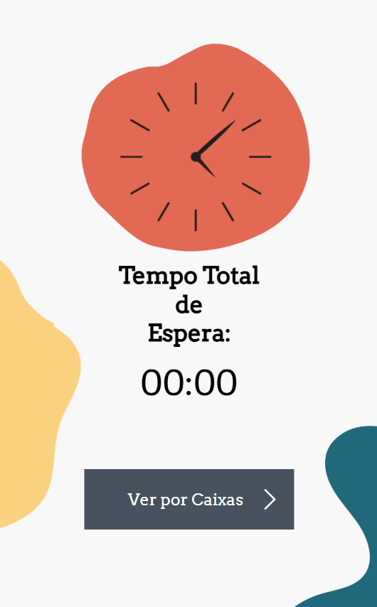
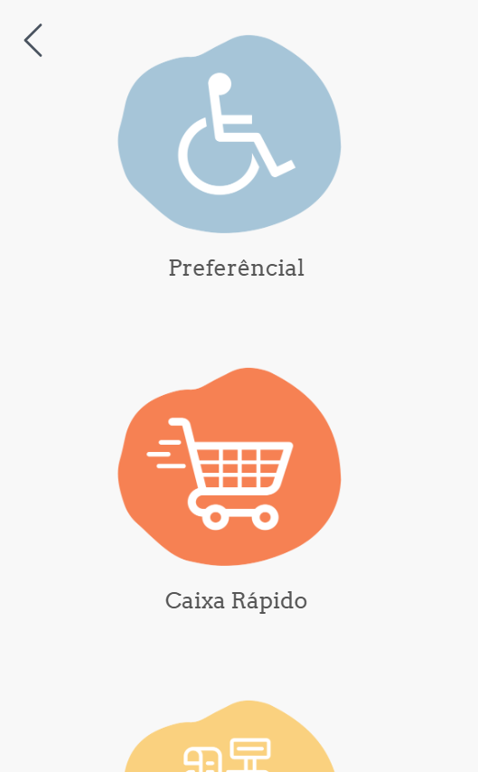
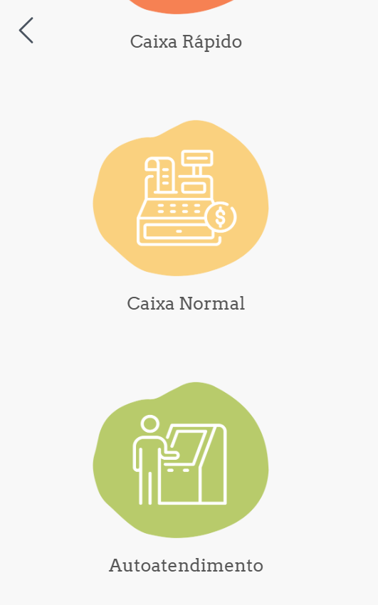
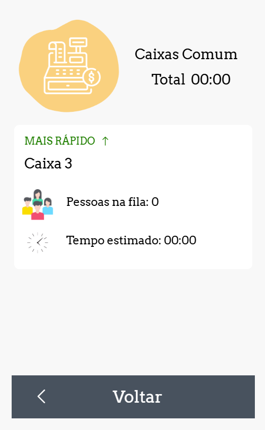
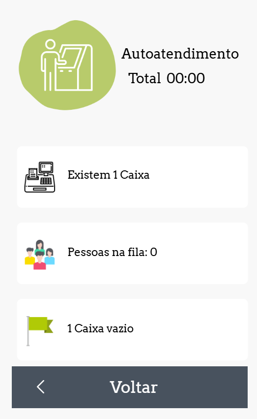

# Espera Zero

> Sistema web para totens e painéis de TV que monitora filas em tempo real usando visão computacional. Estima o tempo de espera por webcam, mostra a situação de cada caixa e destaca qual está mais rápido e mais devagar.


---

## Sobre o projeto

O **Espera Zero** nasceu para resolver um problema comum em estabelecimentos com atendimento por caixas: a incerteza sobre o tempo de espera. Usando **visão computacional via webcam**, o sistema conta em tempo real quantas pessoas estão em cada fila e estima o tempo de espera correspondente.

O totem principal exibe o tempo estimado geral e o detalhamento por caixa, indicando qual está mais rápido e qual está mais lento no momento. Já o painel para TV traz uma **animação de ranking dinâmico**, reordenando visualmente os caixas conforme o atendimento acelera ou desacelera, com uma interface envolvente de orientar o cliente na hora de escolher a fila.

---

## Funcionalidades

- **Contagem de pessoas por webcam** — visão computacional identifica e conta clientes em cada fila
- **Estimativa de tempo de espera** — cálculo em tempo real com base na contagem e no fluxo de atendimento
- **Tela principal do totem** — tempo de espera geral estimado, visível de longe
- **Detalhamento por caixa** — situação individual de cada fila em tempo real
- **Destaque de caixa mais rápido/mais lento** — indicação visual clara para orientar o cliente
- **Painel animado para TV** — ranking dos caixas que se reordena conforme a velocidade de atendimento muda
- **Atualização contínua** — dados recalculados automaticamente à medida que o fluxo de pessoas se altera

---

## Capturas de tela

<p align="center">
  
  
  
  
  
</p>

---

## Tecnologias utilizadas

- [HTML5](https://developer.mozilla.org/pt-BR/docs/Web/HTML)
- [CSS3](https://developer.mozilla.org/pt-BR/docs/Web/CSS)
- [JavaScript](https://developer.mozilla.org/pt-BR/docs/Web/JavaScript)
- [Python](https://developer.mozilla.org/pt-BR/docs/Web/Python)
  
---

## Como executar o projeto

### Pré-requisitos

- Navegador com acesso à webcam
- Câmeras posicionadas em cada caixa/fila a ser monitorada

### Passo a passo

```bash
# Clone o repositório
git clone https://github.com/marianafloriano1/Espera_Zero.git

# Acesse a pasta do projeto
cd Espera_Zero

# Instale as dependências
npm install
pip install flask
pip install opencv-python
pip install opencv-contrib-python

# Inicie o projeto
python app.py


```

Em seguida, acesse:
- Totem principal: `http://localhost:3000`
- Painel de TV: `http://localhost:3000/tv`

---

## Contato

Desenvolvido por **Mariana Santanna** e **Rafaela Santos**

**Mariana Santanna**
- GitHub: [@marianafloriano1](https://github.com/marianafloriano1)
- E-mail: marianafloriano24@gmail.com
- LinkedIn: [www.linkedin.com/in/marianafsantanna](https://www.linkedin.com/in/marianafsantanna)

**Rafaela Santos**
- GitHub: [@RafaApS](https://github.com/RafaApS)
- E-mail: rafaela132006@gmail.com
- LinkedIn: [www.linkedin.com/in/rafaelaapsantos](https://www.linkedin.com/in/rafaelaapsantos)
